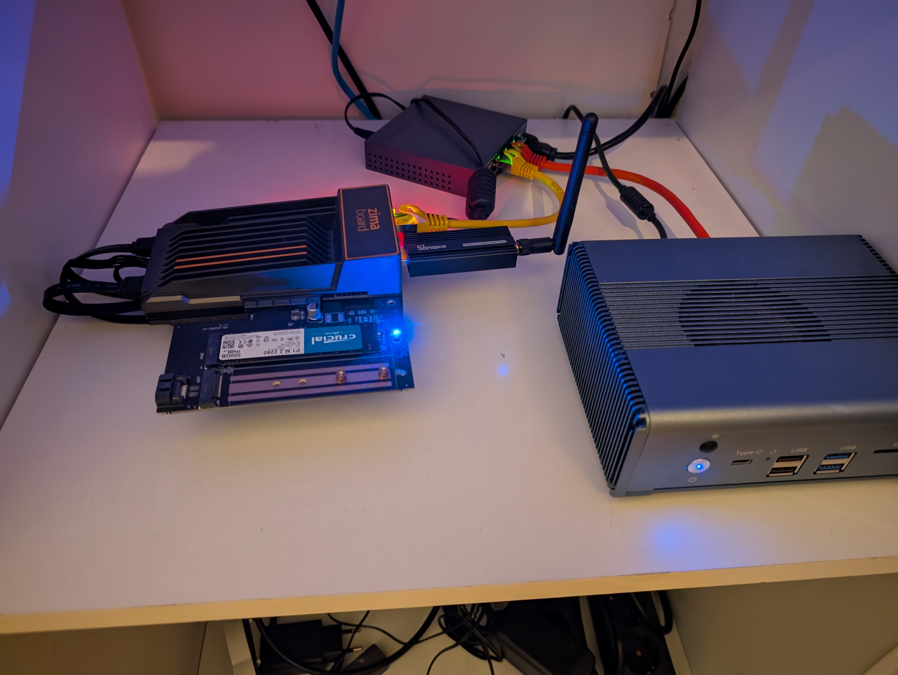
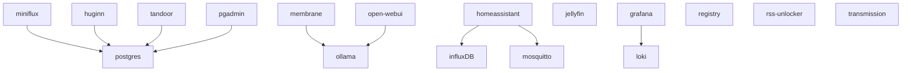

# campfireman's home-lab

This repo originally started as a fork of Jeff Geerling's project [k3s-ansible](https://github.com/k3s-io/k3s-ansible) for deploying k3s on multiple machines with Ansible. Ansible is now resopnsible for setting up the machines and also deploying Docker. Almost all services that are deployed on the k3s cluster are now deployed via terraform, as the state management makes this much easier. Secrets are managed with [sops](https://github.com/getsops/sops).

## Hardware

Currently, the k8s cluster runs on a Ryzen-based, Alibaba-bought server. There are also some services like HomeAssistant and pihole that run better in Docker which are deployed on my zimaboard. The zimaboard also runs two SSDs in btrfs RAID-1 that are avaiable on the network via NFS.

## Services

