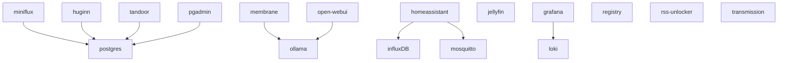

# campfireman's home-lab

## Hardware

Currently, the k8s cluster runs on a Ryzen-based, Alibaba-bought server. There are also some services like HomeAssistant and pihole that run better in Docker which are deployed on my zimaboard. The zimaboard also runs two SSDs in btrfs RAID-1 that are avaiable on the network via NFS.

## Services

